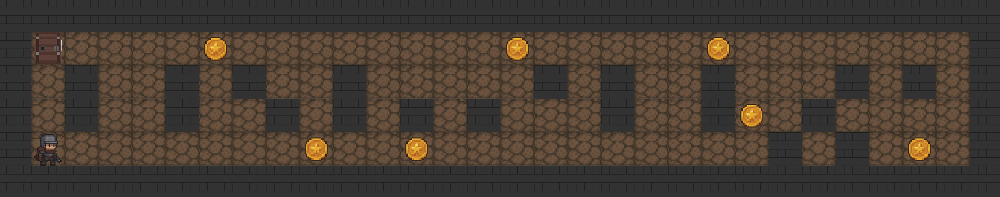

<div align="center">
  <h1>🕹️ so_long 🎮</h1>

  <p><strong>Welcome to my so_long project! 🚀</strong></p>
  <p>Created as part of <strong>42 Madrid</strong>, this project is about building a simple 2D game using <strong>MiniLibX</strong>. Navigate through a map, collect coins, and reach the exit while avoiding obstacles. 🕹️</p>
  
</div>

---

### 🌟 Overview

**so_long** is a small game coded in C where the player must collect all the coins (`C`) on a map and then reach the exit (`E`) to win. The map is read from a file, and the player moves with simple controls, avoiding walls (`1`) and navigating through empty spaces (`0`).

---

### ⚙️ How It Works

| **Component**        | **Description**                                                 |
|----------------------|-----------------------------------------------------------------|
| 📂 Map Loader        | Reads and validates the map from a `.ber` file.                |
| 🛠️ Graphics Engine   | Renders the map and player using MiniLibX functions.           |
| 🔄 Movement Handler  | Manages player movement and updates the game state.             |
| 🛡️ Error Handler     | Checks for invalid maps, missing elements, or invalid moves.    |

---

### 🕹️ Gameplay Elements

| Symbol | Meaning             |
|--------|---------------------|
| `1`    | Wall (impassable)   |
| `0`    | Empty space         |
| `C`    | Collectible coin    |
| `P`    | Player starting pos |
| `E`    | Exit                |

---

### 📂 Example Map File (map.ber)

```
111111
1P0C1E
100001
1C0C11
111111
```

---

### 🎮 Controls

- Use arrow keys or WASD to move the player.
- Collect all coins before reaching the exit.
- Press ESC or close window to quit.

---

### 📂 Running the Game

```bash
$ ./so_long map.ber
```

The window will open showing the map, and you can start playing immediately.

---

<div align="center">
  <p><i>✨ Built with 💻, 🎮 and ☕ at 42 Madrid ✨</i></p>
</div>
